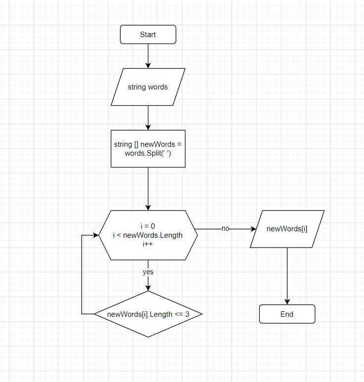

# Control Work

## Задача:

 Написать программу, которая из имеющегося массива строк формирует новый массив из строк, длина которых меньше, либо равна 3 символам. Первоначальный массив можно ввести с клавиатуры, либо задать на старте выполнения алгоритма. При решении не рекомендуется пользоваться коллекциями, лучше обойтись исключительно массивами.

## Описание работы программы:

Пользователь вводит несколько слов через пробел. Далее с помощью метода Split разбиваем строку по разделителю (в нашем случае это пробел). Метод возвращает массив слов. Затем проводится проверка: если в слове 3 и менее символа - выводим слово. Делаем проверку по длине массива слов. 

## Блок-схема

